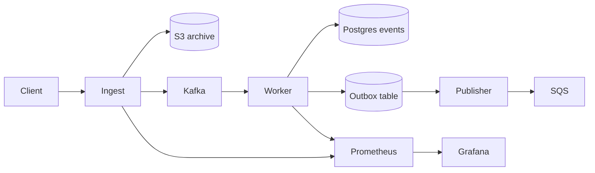

# StreamForge

A self-hosted, multi-tenant event ingestion service. Accepts batched events over HTTP, archives them to object storage, and streams them through Kafka into Postgres with a transactional outbox for downstream notifications.

The goal is straightforward: never lose an accepted event, even when Postgres, Kafka, or downstream consumers misbehave.

## How it works



1. **Ingest** validates the batch, writes the raw payload to S3, then publishes to Kafka keyed by tenant. Clients only get a 2xx after the archive write succeeds.
2. **Worker** consumes from Kafka, writes events and outbox rows in a single Postgres transaction, and only commits Kafka offsets after the transaction succeeds.
3. **Outbox publisher** drains the outbox table to SQS, so downstream notifications fire only when the event is durably stored.
4. **Replay CLI** can re-publish archived S3 payloads (filtered by tenant and time window) when something downstream needs to be rebuilt.

Per-tenant Kafka partitioning preserves ordering within a tenant. Idempotency keys prevent duplicate writes on redelivery.

## Quickstart

```bash
docker compose up -d

curl -sS -X POST http://localhost:8080/v1/events \
  -H "Content-Type: application/json" \
  -d '{
    "tenant_id": "tenant-a",
    "events": [
      {"event_type": "user.signup", "body": {"source": "web"}, "client_timestamp": "2026-05-01T00:00:00Z"}
    ]
  }'
```

Grafana is at `http://localhost:3000` with a provisioned StreamForge dashboard.

## Configuration

`streamforge.yaml` holds the defaults. Any field can be overridden with a `STREAMFORGE_*` environment variable (for example `STREAMFORGE_POSTGRES_DSN`).

## Operational notes

| Failure mode | What happens |
|---|---|
| Postgres down | Worker writes fail, Kafka offsets are not committed, backlog is replayed on recovery |
| Worker crashes mid-batch | Uncommitted offsets are redelivered; idempotency keys block duplicate writes |
| Kafka rebalance | Tenant-keyed partitioning preserves per-tenant ordering across owners |
| Malformed event | Ingest returns 400 with details; worker-side parse failures land in the DLQ table |
| Need to rebuild a sink | `cmd/replay --tenant=... --from=... --to=... --rps=...` re-publishes from S3 |

DLQ inspection lives in the `dlq_events` Postgres table; correlate by `correlation_id` and tenant.

## Deployment

- Local: `docker compose up`
- Kubernetes: manifests in `deploy/k8s/` (apply order documented in that folder's README)

## Limitations

- Single-region; cross-region failover is out of scope.
- Postgres is the analytics sink; tenants pushing 50k+ events/sec should consider a ClickHouse sink instead.
- Replay throughput is bounded by S3 list/fetch latency.
- Schema cache across ingest replicas is eventually consistent (60s refresh).
- Ships dashboards but no opinionated alert policies.

## License

Apache 2.0.
