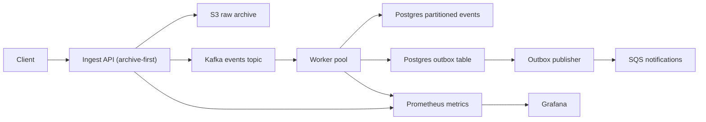

# Event pipelines fail silently under pressure without durable ingest, explicit backpressure, and replayable archives.

StreamForge is a self-hosted real-time event analytics control plane that preserves ingest reliability under dependency failures, schema drift, and traffic spikes.

## Why StreamForge

Event platforms usually fail in ways operators discover too late: retries amplify traffic, partitions drift out of order, and partial writes leave no authoritative recovery source. Multi-tenant systems are worse because one noisy tenant can saturate worker pools or connection pools for everyone else. StreamForge focuses on bounded failure: archive-first ingest, explicit outbox guarantees, idempotent writes, and operational visibility tied to the golden signals teams actually page on.

## Quickstart (<5 minutes)

1. Start local dependencies and services:
   - `docker compose up -d`
2. Submit an event batch:
   - `curl -sS -X POST http://localhost:8080/v1/events -H "Content-Type: application/json" -d '{"tenant_id":"tenant-a","events":[{"event_type":"user.signup","body":{"source":"web"},"client_timestamp":"2026-05-01T00:00:00Z"}]}'`
3. Open Grafana:
   - `http://localhost:3000`
4. View dashboard:
   - `StreamForge` dashboard under the provisioned folder.

## Architecture

The ingest path writes every accepted batch to S3 before acknowledging clients, then publishes tenant-keyed messages to Kafka. Worker consumers persist events and outbox rows transactionally so notification fanout happens iff the event is durable. Replay tooling can republish archived S3 payloads with tenant and time filters during incident recovery.

## Configuration

Primary runtime configuration is in `streamforge.yaml`. Environment overrides follow `STREAMFORGE_*` keys via Viper.

## Operations

- **Postgres down**
  - Worker writes fail, offsets are not committed, and Kafka retains backlog for redelivery.
- **Worker crash**
  - Uncommitted offsets are redelivered; idempotency gate prevents duplicate durable writes.
- **Kafka rebalance**
  - Tenant-keyed partitioning preserves per-tenant order within partition ownership transitions.
- **Malformed event**
  - Ingest returns `400` with validation details; worker-side parse failures are captured in DLQ storage.
- **DLQ inspection**
  - Query `dlq_events` in Postgres and correlate with `correlation_id` and tenant.
- **Backfill via replay**
  - Use `cmd/replay` with `--tenant`, `--from`, `--to`, and `--rps` controls.

## Deployment

- Local: `docker compose`
- Kubernetes with Helm: `deploy/helm/streamforge`
- Raw Kubernetes: `deploy/k8s` (see apply order in that README)

## Limitations

- Single-region assumptions across Kafka, Postgres, and object storage.
- Postgres analytics throughput ceiling around high sustained ingest; tenants at ~50k+ events/sec should evaluate ClickHouse sinks.
- Alerting is dashboard-oriented by default and does not ship opinionated alert policies.
- Replay throughput is bounded by S3 object listing and object fetch latency.
- Schema cache synchronization across ingest replicas is eventually consistent with a 60s refresh window.

## License

Apache 2.0. See `LICENSE`.

## Contributing

See `CONTRIBUTING.md`.
